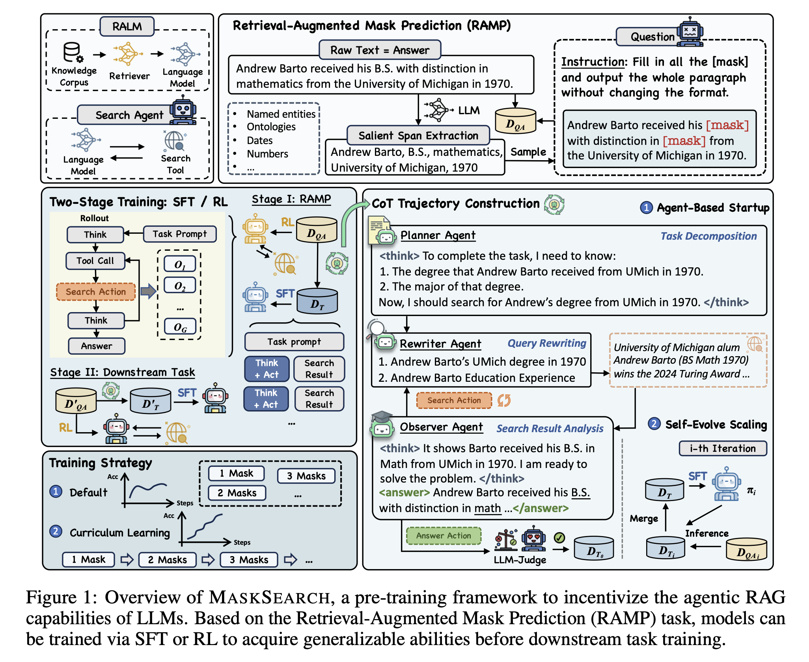
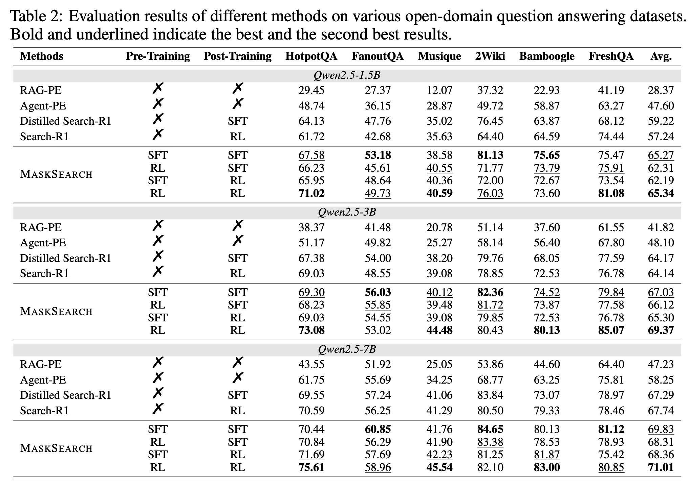

# MaskSearch: A Universal Pre-Training Framework to Enhance Agentic Search Capability

[](https://pytorch.org/)[](https://arxiv.org/abs/2505.20285)

## 🚀 Introduction

- We propose **MaskSearch**, a novel pre-training framework to further enhance the **universal search capability of agents**.
- We introduce the **Retrieval Augmented Mask Prediction (RAMP) task**, where the model learns to leverage search tools to fill masked spans on a large number of pre-training data, thus acquiring universal retrieval and reasoning capabilities for LLMs.
- We combine agent-based and distillation-based methods to generate training data, starting with a multi-agent system consisting of a planner, rewriter, observer, and followed by a self-evolving teacher model.
- Extensive experiments demonstrate that **MaskSearch** significantly enhances the performance of LLM-based search agents on both in-domain and out-of-domain downstream tasks.




## 💡 Performance


## 🛠 Running MaskSearch

Before running, please replace the placeholder with your own Qwen key and Google_search key in `src/RAMP/model.py`, `src/multi_agent/model.py` and `src/multi_agent/web_news_get.py`.
```python
DASHSCOPE_API_KEY = "YOUR_API_KEY"
GOOGLE_API_KEY = "YOUR_API_KEY"
```

Dependencies

```bash
pip install -r requirements.txt
```

### Step 1. Generate RAMP QA through Wikipedia
The first step is to generate RAMP QA data using Wikipedia as the data source.

The Wikipedia data can get from [here](https://dumps.wikimedia.org/enwiki/).

```python
python gen_qa.py \
    --model "$model" \
    --corpus "Wikipedia Directory"\
    --output_path "output_path"
```

### Step 2. CoT Trajactory Construction
The second step is to generate CoT trajectories for QA through a Multi Agent approach to construct SFT data.

You can customize your own dataset and configure the data path in `src/multi_agent/dataset.py`
```python
python cot_construct.py \
    --model "$model" \
    --dataset "dataset"\
    --output_path "output_path"
```

### Step 3. Training with SFT/RL 
After generating the data, the third step is to use the data for training. For SFT, you can refer to the training process of [LLaMA-Factory](https://github.com/hiyouga/LLaMA-Factory); for RL, you can refer to [Search-R1](https://github.com/PeterGriffinJin/Search-R1) and [ZeroSearch](https://github.com/Alibaba-NLP/ZeroSearch).


## 🙏 Acknowledgements
This work is implemented based on [ChineseWiki](https://github.com/mattzheng/ChineseWiki), [LLaMA-Factory](https://github.com/hiyouga/LLaMA-Factory), [Search-R1](https://github.com/PeterGriffinJin/Search-R1), and [verl](https://github.com/volcengine/verl). We greatly appreciate their valuable contributions to the community.

## 📝 Citation

```bigquery
@article{wu2025masksearchuniversalpretrainingframework,
      title={MaskSearch: A Universal Pre-Training Framework to Enhance Agentic Search Capability}, 
      author={Weiqi Wu and Xin Guan and Shen Huang and Yong Jiang and Pengjun Xie and Fei Huang and Jiuxin Cao and Hai Zhao and Jingren Zhou},
      year={2025},
      eprint={2505.20285},
      archivePrefix={arXiv},
      primaryClass={cs.CL},
      url={https://arxiv.org/abs/2505.20285}, 
}
```